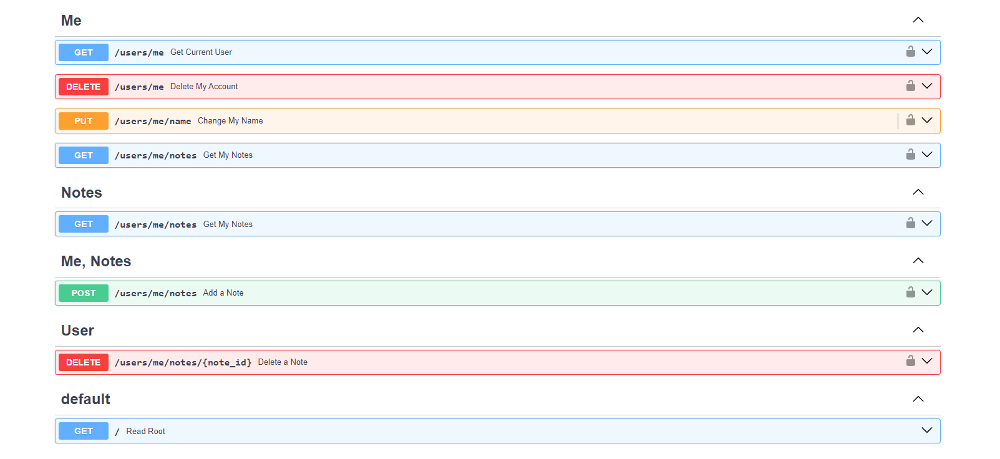

# CRUD APP

## Project Overview

This project is a CRUD application for managing user accounts. It is built using FastAPI for the backend and a simple frontend built with React.

## Key Features

- **User Management**: Create, read, update, and delete user accounts.
- **Authentication**: OAuth2 authentication and Google Sign-In.
- **RESTful API**: REST endpoints for integration with frontend.
- **Automated Testing**: Test suite using `pytest`.
- **Continuous Integration**: Jenkins pipeline for automated build and testing.
- **Docker Support**: Dockerized setup for easy deployment and development.

## Installation and setup

#### 1.Clone the Repository:
```
git clone https://github.com/stefan1anuby/CRUD-app-with-google-sign-in.git
cd CRUD-app-with-google-sign-in
```

#### 2.Setup with docker-compose:

If you want the Google Sign In to work you need to change the .env.example (and rename it to .env). This is optionally because there is a "Sign in with test provider" that just works for test purposes.
```
docker-compose up --build
```
Now you can go to ``http://localhost:3000/`` for the React App, to the ```http://localhost:8000/``` for the backend and to the ```http://localhost:8000/docs``` for the backend OPENAPI documentation

#### 3.Test the backend:

This is took from the backend/Jenkins file:
```
docker build -t my-fastapi-app ./backend
docker run --rm \
-e SECRET_KEY=$SECRET_KEY \
-e JWT_SIGN_ALGORITHM=$JWT_SIGN_ALGORITHM \
-e STAGE=TEST \
my-fastapi-app pytest app/tests
```

#### 4.Images



